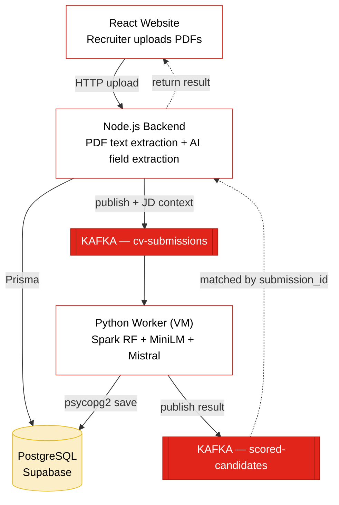

<div align="center">

# Resumind

**Smart CV screening, at the speed of Big Data.**

A distributed, JD-aware recruitment pipeline built on Apache Kafka, Spark ML,
sentence embeddings, and Mistral AI.

[Architecture](#architecture) · [Stack](#tech-stack) · [Setup](#setup) · [How it works](#how-it-works)

</div>

---

## About

Resumind is a recruitment screening platform that evaluates each CV **against the specific job description it was submitted for** — not against jobs in general. A recruiter creates a posting in the web UI, uploads candidate PDFs, and the system extracts their info, scores them with two complementary ML models, generates tailored interview questions, and delivers a decision in seconds.

This was built as the final project for the Big Data course at Université Mundiapolis.

**What makes it interesting from a Big Data standpoint:**

- **Asynchronous by design** — Apache Kafka decouples the website from the ML worker. The user never blocks on Spark.
- **Distributed ML scoring** — a Spark MLlib Random Forest trained on 600,000 synthetic resumes runs on a separate VM.
- **JD-aware semantic matching** — sentence-transformer embeddings compute cosine similarity between each candidate's profile and the actual job description, fixing the classic "great resume for the wrong role" problem.
- **Request/Reply pattern over Kafka** — the backend turns the inherently-async messaging system into a synchronous-feeling API for the user, using submission IDs and an in-memory resolver map.
- **Multi-tenant pipelines** — every job posting runs its own isolated screening flow.

---

## Architecture



**The flow on every upload:**

1. Recruiter uploads a PDF on the JD detail page → Node receives it
2. Node extracts text (with Mistral OCR fallback for image-PDFs) and uses Mistral Chat to pull structured fields
3. Node publishes a message to the `cv-submissions` Kafka topic with the full JD context attached, and a unique `submission_id`
4. Python worker on the VM consumes the message, scores the candidate two ways (Spark RF + MiniLM cosine similarity), blends the scores, generates JD-aware interview questions with Mistral, saves to Postgres
5. Worker publishes the result to `scored-candidates` with the same `submission_id`
6. Node has been awaiting a `Promise` keyed by that ID — resolves it, returns the full result to the React UI

---

## Tech stack

### Webapp (this repo)

| Component | Technology |
|---|---|
| Frontend | React + react-router-dom |
| Backend | Node.js + Express 5 |
| ORM | Prisma 7 (with `prisma-client-js` legacy generator) |
| Database | PostgreSQL — Supabase free tier |
| Kafka client | kafkajs |
| PDF extraction | pdf-parse (v2 API) |
| AI (Node side) | Mistral AI — `mistral-small-latest`, `mistral-ocr-latest` |

### Worker (runs on a separate Linux VM — not in this repo)

| Component | Technology |
|---|---|
| Runtime | Python 3 |
| Messaging | kafka-python |
| Distributed ML | Apache Spark + MLlib |
| CV scoring | Random Forest (100 trees, trained on 600k synthetic rows) |
| Semantic matching | sentence-transformers `all-MiniLM-L6-v2` |
| DB client | psycopg2 |
| Kafka | Apache Kafka 4.2 in KRaft mode (no Zookeeper) |

---

## Repository layout

```
.
├── client/                 # React SPA (port 3000)
│   ├── src/
│   │   ├── App.jsx
│   │   ├── App.css         # design tokens + dark mode + animations
│   │   └── components/
│   │       ├── JdListPage.jsx
│   │       ├── JdDetailPage.jsx
│   │       ├── CandidateDetailPage.jsx
│   │       ├── UploadCvModal.jsx
│   │       └── PipelineTab.jsx
│   └── package.json
└── server/                 # Express backend (port 5001)
    ├── index.js            # routes + Kafka producer/consumer
    ├── db.js               # Prisma singleton with pg adapter
    ├── prisma/
    │   └── schema.prisma
    ├── prisma.config.ts    # Prisma 7 — DATABASE_URL lives here
    ├── cv_uploads/         # uploaded PDFs (gitignored, auto-created)
    ├── .env                # not committed
    └── package.json
```

---

## Setup

### Prerequisites

- **Node.js 18+** and **npm**
- **Python 3.10+** and **Apache Kafka 4.2** on a separate Linux machine (or VM)
- A free **Supabase** project (PostgreSQL)
- A free **Mistral AI** API key — https://console.mistral.ai

### 1. Clone and install

```bash
git clone https://github.com/<your-username>/resumind.git
cd resumind

# Install backend deps
cd server
npm install

# Install frontend deps
cd ../client
npm install
```

### 2. Configure environment variables

Create `server/.env`:

```env
DATABASE_URL="postgresql://postgres.<project-ref>:<password>@aws-0-<region>.pooler.supabase.com:5432/postgres"
MISTRAL_API_KEY="your-mistral-api-key"
KAFKA_BROKER="<vm-ip>:9092"
```

**Important about the database URL:** use Supabase's **Session pooler** (port 5432). The Direct connection uses IPv6, which isn't available on the free tier.

### 3. Set up the database

```bash
cd server
npx prisma migrate deploy   # apply migrations
npx prisma generate         # generate the Prisma client
```

Two tables get created: `JobDescription` and `Candidate` (with FK + cascade delete).

### 4. Set up the Python worker (on the VM)

The worker isn't in this repo, but here's what to do on the Linux side. Detailed steps:

```bash
# 1. Install Apache Kafka 4.2 in KRaft mode (skip Zookeeper). See:
#    https://kafka.apache.org/quickstart

# 2. Install Python deps
pip install kafka-python pyspark psycopg2-binary requests sentence-transformers

# 3. Train (or download) the Spark Random Forest model
#    Save it to: cv_spark_model/
#    Features: skills_count, years_clean, has_degree
#    Labels: 0 = shortlist, 1 = review, 2 = reject

# 4. Set environment variables before running the consumer:
export DATABASE_URL="<same URL as in server/.env>"
export MISTRAL_API_KEY="<same key>"
export SHORTLIST_THRESHOLD="0.65"
export REJECT_THRESHOLD="0.49"
export CV_SCORE_WEIGHT="0.20"   # JD weight = 1 - this = 0.80

# 5. Start Kafka and create the topics:
#    cv-submissions  (incoming)
#    scored-candidates  (outgoing)

# 6. Run the consumer: cv_consumer.py
#    It loads Spark + MiniLM at startup, then blocks on the cv-submissions topic.
```

The consumer's pipeline per message:

```
Spark RF → cv_score
MiniLM cosine(JD, candidate) → jd_match_score
final = 0.20 × cv_score + 0.80 × jd_match_score
  ≥ 0.65   → shortlist
  0.49–0.65 → review
  < 0.49   → reject
```

For `reject` candidates, the Mistral question generation step is skipped to save API calls.

### 5. Run the webapp

Two terminals on the Windows/Mac side:

```bash
# Terminal 1 — backend
cd server
npm start    # or: node index.js
```

You should see:
```
✅ Producer connected to Kafka
✅ Consumer subscribed to scored-candidates
✅ CV Screener backend running on http://localhost:5001
```

```bash
# Terminal 2 — frontend
cd client
npm start
```

Open `http://localhost:3000`.

---

## How it works

### The scoring model — why two of them?

A single ML model that looks at "is this resume strong?" cannot tell you whether the candidate fits *this specific job*. We saw this directly: a nursing CV got shortlisted with 94% confidence against a Senior React Developer posting, because the model only knew about generic features (years of experience, degree, skills count).

The fix: a second pass using **sentence-transformer embeddings**. Both the job description and the candidate's profile (skills + experience + education) get embedded into 384-dimension vectors, and cosine similarity gives a `jd_match_score` in [0, 1] measuring semantic fit.

We then blend:

```
final_score = 0.20 × cv_score + 0.80 × jd_match_score
```

JD-match gets the heavy weight because *that's the question the recruiter is actually asking*. The CV score serves as a sanity check ("does this person look competent at all").

The thresholds (shortlist ≥ 0.65, reject < 0.49) and the weight (0.20) are **all tunable via environment variables** without touching code, so they can be calibrated per organization.

### Why Kafka?

Three reasons, all of them genuine Big Data concerns:

1. **Decoupling** — the website never blocks on Spark or Mistral. It publishes a message and listens for the reply.
2. **No data loss** — if the worker crashes or restarts, candidates queue safely in Kafka and get processed when it comes back online.
3. **Fan-out ready** — Kafka topics naturally support multiple consumers. A future Spark Streaming analytics dashboard could subscribe to `scored-candidates` independently, with zero changes to the existing flow.

### The Request/Reply pattern

Kafka is inherently asynchronous, but a user clicking "Upload CV" expects a synchronous response. We implement Request/Reply:

1. Node generates a `submission_id` (UUID), publishes it as part of the Kafka message
2. Node registers a `Promise` resolver in an in-memory `Map`, keyed by that ID
3. Node's Kafka consumer is permanently subscribed to `scored-candidates`; when a message arrives whose `submission_id` matches a pending resolver, it resolves the Promise
4. The HTTP handler `await`s the Promise (with a 30s timeout) and returns the result to React

It turns an async messaging backbone into a synchronous-feeling API, without losing any of Kafka's resilience benefits.

---

## Features

- **JD CRUD** — create, edit, delete job postings; each one is a separate screening pipeline
- **PDF upload** with automatic image-PDF detection and Mistral OCR fallback
- **AI field extraction** — Mistral Chat returns structured JSON (name, email, skills, education, years)
- **Two-model scoring** — Spark RF + sentence-transformer embeddings, blended
- **JD-aware interview questions** generated by Mistral (5 per candidate, references the actual JD)
- **Candidate management** — view, search, filter (shortlisted/review/rejected), download original CV PDF, delete
- **Dark mode** with persistence (localStorage), respects system preference on first load
- **Live pipeline-step loader** in the upload modal so the user sees the 6 stages of processing in real time

---

## Authors

- **Amine AMMOR**
- **Rim AKRACHE**

Université Mundiapolis · Big Data course final project · 2026

---

## License

This project was built as coursework. Available for academic reference. Not licensed for commercial use without permission from the authors.
